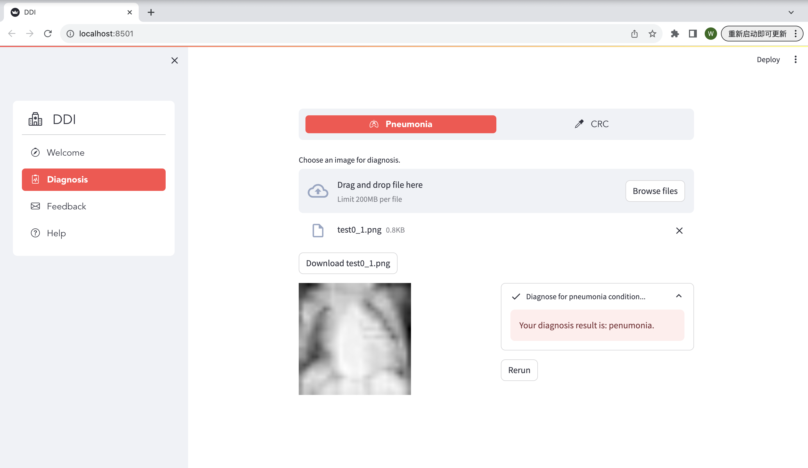
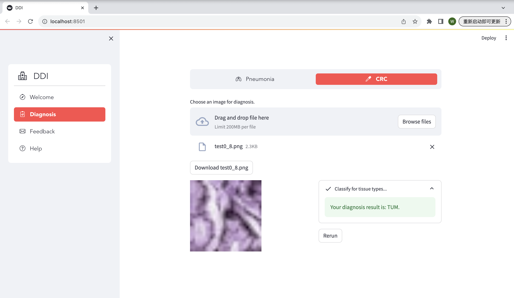

# AMLS_assignment23_24-SN23043574
This is the final assignment for 23/24 AMLS ELEC0134 Msc IMLS SN23043574. Notice that there is another backup project in Google drive link provided in my paper. The usage is illustrated in following sections.
>**Time:** 07/11/2023-12/01/2024 \
**Author:** 23043574 \
**Programme:** Msc Integrated Machine Learning Systems (TMSIMLSSYS01) \
**Module**: ELEC0134 Applied Machine Learning Systems \
**Project name:** AMLS I final assignment \
**Scope:** Machine Learning and Deep Learning, Research, Simulation \
**Github:** https://github.com/uceewl4/AMLS_assignment23_24-SN23043574.git (The private respository will become public once the deadline is passed. You can also download the project through Google Drive link provided in the report. In google drive, there are two directories, the first one is AMLS_assignment23_24-SN23043574, the second one is the backup project zip. The backup project is around 2GB including all preprocessed datasets. You can download the first directory individually. It may take some time to preprocess dataset. If you want to check model implementation with preprocessed datasets provided, you can download the backup project as well. Please follow the guidelines in Requirement and Usage to run the project. Thanks a lot.)

## Description
### 1. Project Structure 
- **main.py:** main codes for running the project
- **interface.py:** codes for designing and launching DDI system application
- **utils.py:** tools, visualizations and metrics
- **requirement.txt:** package requirements for the project
- **environmental.yml:** conda environment for the project
- **main_page.png:** image for DDI screenshot of main page
- **diagnosis_A.png:** image for DDI screenshot of pneumonia diagnosis
- **diagnosis_B.png:** image for DDI screenshot of CRC diagnosis
- **Datasets**
  - pathmnist: saved .png images of pathmnist datasets for task B (this directory can be downloaded with command lines)
  - pneumoniamnist: saved .png images of pneumoniamnist datasets for task A (this directory can be downloaded with command lines)
  - pathmnist.csv: filename and labels of pathmnist datasets for task B (this file can be downloaded with "npz" argument)
  - pathmnist.npz: .npz data for task B (this file can be downloaded with "npz" argument)
  - pneumoniamnist.csv: filename and labels of penumonia datasets for task A (this file can be downloaded with "npz" argument)
  - pneumoniamnist.npz: .npz data for task A (this file can be downloaded with "npz" argument)
    
- **A**
  - **data_preprocessing.py:**: data preprocessing and data augmentation for task A
  - **models:**
    - baselines.py: ML baselines
    - CNN.py: customized network of CNN
    - MLP.py: customized network of MLP
    - EnsembleNet.py: customized network of EnsembleNet integrated with MLP and CNN
    - DenseNet201.py: pre-trained network with concatenated classifier of DenseNet201
    - InceptionV3.py: pre-trained network with concatenated classifier of InceptionV3
    - MobileNetV2.py: pre-trained network with concatenated classifier of MobileNetV2
    - ResNet50.py: pre-trained network with concatenated classifier of ResNet50
    - VGG16.py: pre-trained network with concatenated classifier of VGG16
    - KMeans.py: model of K-Means clustering method

- **B**
  - **data_preprocessing.py:**: data preprocessing and data augmentation for task B
  - **models:**
    - baselines.py: ML baselines
    - CNN.py: customized network of CNN
    - MLP.py: customized network of MLP
    - EnsembleNet.py: customized network of EnsembleNet integrated with MLP and CNN
    - DenseNet201.py: pre-trained network with concatenated classifier of DenseNet201
    - InceptionV3.py: pre-trained network with concatenated classifier of InceptionV3
    - MobileNetV2.py: pre-trained network with concatenated classifier of MobileNetV2
    - ResNet50.py: pre-trained network with concatenated classifier of ResNet50
    - VGG16.py: pre-trained network with concatenated classifier of VGG16
    - KMeans.py: model of K-Means clustering method

- **Outputs**: all outputs of the project including preprocessed dataset, metrics and visualization from modelling experiments and trials. 
  - **images:** generated images of modelling experiments and trials
    - **clustering:** 3D image for K-Means clustering
    - **confusion_matrix:** confusion matrix for experiments
    - **hyperpara_selection:** hyperparameter curvers for grid search models
    - **interface:** images uploaded by users of DDI for diagnosis
    - **roc_curve:** AUC ROC curves for experiments
    - **nn_curves:** NN curves generated by TensorboardX
    - **trees:** DT visualization for experiments
  - **label_distribution_task.png:** label distribution for task A
  - **label_distribution_taskB.png:** label distribution for task B
  - **pathmnist:** 
    - **preprocessed_data:** datasets after preprocessing and augmentation for task B
    - **smote_data:** datasets after SMOTE for data augmentation.
    ***Notice that this directory will only appear in backup project because it's an experimental result for SMOTE, which is not included in final data preprocessing procedure. Detailed reason can be seen in the report.***
  - **pneumoniamnist** 
    - **preprocessed_data:** datasets after preprocessing and augmentation for task A
    - **smote_data:** datasets after SMOTE for data augmentation.
    ***Notice that this directory will only appear in backup project because it's an experimental result for SMOTE, which is not included in final data preprocessing procedure. Detailed reason can be seen in the report.***

- **runs**: this directory may also be generated by TensorboardX if you are checking and running MLP/CNN networks. 

### 2. Experimental Results
> Modelling experiments and trials are conducted for two tasks, including task A: Penumonia Diagnosis, task B: CRC Diagnosis
> 
> The performance of various methods from ML baselines and DL networks is compared accordingly.

2.1 Pneumonia Diagnosis

| **Models**      |             | **train** |       |       |       | **val**   |       |       |       | **test** |       |      |      |
|:---------------:|:---------------:|:---------:|:---------:|:---------:|:---------:|:---------:|:---------:|:---------:|:---------:|:--------:|:---------:|:--------:|:--------:|
|   **Pretrained**          |      **Classifiers**           | acc       | pre       | rec       | f1        | acc       | pre       | rec       | f1        | acc      | pre       | rec      | f1       |
| **Baselines**   | LR              | 97.8964   | 98.4090   | 97.3669   | 97.8852   | 93.2051   | 88.5584   | 99.2308   | 93.5913   | 94.7301  | 95.7895   | 93.5733  | 94.6684  |
|             | KNN             | 96.4081   | 97.8460   | 94.9056   | 96.3533   | 90.7692   | 85.8108   | 97.6923   | 91.3669   | 95.1157  | 97.0509   | 93.0591  | 95.0131  |
|             | SVM             | 99.5850   | 99.7988   | 99.3703   | 99.5841   | 97.6923   | 95.5882   | 100.0000  | 97.7444   | 96.2725  | 96.8750   | 95.6298  | 96.2484  |
|             | DT              | 95.8930   | 96.6269   | 95.1059   | 95.8604   | 92.4359   | 89.1253   | 96.6667   | 92.7429   | 91.5167  | 94.2466   | 88.4319  | 91.2467  |
|             | NB              | 79.6938   | 71.8559   | 97.6245   | 82.7812   | 71.6667   | 63.9209   | 99.4872   | 77.8335   | 80.5913  | 72.8846   | 97.4293  | 83.3883  |
|             | RF              | 100.0000  | 100.0000  | 100.0000  | 100.0000  | 100.0000  | 100.0000  | 100.0000  | 100.0000  | 97.0437  | 97.4039   | 96.6581  | 97.0323  |
|             | ABC             | 98.8409   | 98.8549   | 98.8266   | 98.8407   | 99.3573   | 99.2308   | 99.4859   | 99.3582   | 85.2564  | 78.3505   | 97.4359  | 86.8571  |
| **DenseNet-201** | LR              | 97.4098   | 97.5869   | 97.2238   | 97.4050   | 93.3333   | 89.8585   | 97.6923   | 93.6118   | 94.8586  | 94.1772   | 95.6298  | 94.8980  |
|             | KNN             | 93.2456   | 94.2330   | 92.1294   | 93.1693   | 87.3044   | 83.4483   | 93.0769   | 88.0000   | 91.7738  | 92.4282   | 91.0026  | 91.7098  |
|             | SVM             | 95.7785   | 96.1084   | 95.4207   | 95.7633   | 91.2821   | 86.4253   | 97.9487   | 91.8269   | 95.2442  | 95.1282   | 95.3728  | 95.2503  |
|             | DT              | 91.8575   | 90.8178   | 93.1311   | 91.9599   | 84.4872   | 78.9247   | 94.1026   | 85.8480   | 88.9460  | 86.5060   | 92.2879  | 89.3035  |
|             | NB              | 84.6737   | 78.6204   | 95.2490   | 86.1395   | 79.7436   | 71.8045   | 97.9487   | 82.8633   | 84.7044  | 78.4810   | 95.6298  | 86.2109  |
|             | RF              | 99.9428   | 99.9142   | 99.9714   | 99.9428   | 100.0000  | 100.0000  | 100.0000  | 100.0000  | 84.1026  | 77.7083   | 95.6410  | 85.7471  |
|             | ABC             | 97.1666   | 97.1936   | 97.1380   | 97.1658   | 97.3008   | 96.9388   | 97.6864   | 97.3111   | 85.8974  | 79.7872   | 96.1538  | 87.2093  |
| **Inception-V3** | LR              | 93.3171   | 92.8875   | 93.8180   | 93.3504   | 89.4872   | 85.1598   | 95.6410   | 90.0966   | 92.6735  | 92.5641   | 92.8021  | 92.6829  |
|             | KNN             | 93.4602   | 93.1025   | 93.8752   | 93.4872   | 87.8205   | 82.8508   | 95.3846   | 88.6770   | 92.2879  | 92.9504   | 91.5167  | 92.2280  |
|             | SVM             | 95.3921   | 94.7012   | 96.1649   | 95.4274   | 91.6667   | 87.5289   | 97.1795   | 92.1021   | 93.5733  | 94.2559   | 92.8021  | 93.5233  |
|             | DT              | 89.8970   | 89.3563   | 90.5839   | 89.9659   | 85.6410   | 81.3063   | 92.5641   | 86.5707   | 83.9332  | 84.0206   | 83.8046  | 83.9125  |
|             | NB              | 84.3589   | 81.4020   | 89.0670   | 85.0622   | 78.4615   | 73.6170   | 88.7179   | 80.4651   | 85.3470  | 83.4550   | 88.1748  | 85.7500  |
|             | RF              | 97.9107   | 95.9890   | 100.0000  | 97.9535   | 98.4576   | 97.0075   | 100.0000  | 98.4810   | 83.2051  | 77.4947   | 93.5897  | 84.7851  |
|             | ABC             | 93.6033   | 93.0246   | 94.2759   | 93.6461   | 93.8303   | 94.9868   | 92.5450   | 93.7500   | 83.5897  | 79.3722   | 90.7692  | 84.6890  |
| **MobileNe-tV2** | LR              | 82.2124   | 82.1296   | 82.3412   | 82.2352   | 77.8205   | 75.6501   | 82.0513   | 78.7208   | 85.0900  | 84.5570   | 85.8612  | 85.2041  |
|             | KNN             | 86.8632   | 90.5286   | 82.3412   | 86.2410   | 83.7179   | 82.9574   | 84.8718   | 83.9037   | 84.9614  | 89.0805   | 79.8915  | 84.1248  |
|             | SVM             | 88.6949   | 89.9527   | 87.1208   | 88.5141   | 83.8462   | 82.5123   | 85.8974   | 84.1709   | 87.0180  | 88.7097   | 84.8329  | 86.7280  |
|             | DT              | 85.9187   | 85.1935   | 86.9491   | 86.0623   | 82.5641   | 79.5349   | 87.6923   | 83.4146   | 83.0334  | 81.5725   | 85.3470  | 83.4171  |
|             | NB              | 79.0212   | 72.6542   | 93.0738   | 81.6060   | 74.8718   | 68.3019   | 92.8205   | 78.6957   | 79.1774  | 73.0223   | 92.5450  | 81.6327  |
|             | RF              | 85.1889   | 79.3928   | 95.0487   | 86.5182   | 84.8329   | 79.0150   | 94.8586   | 86.2150   | 77.5641  | 71.3718   | 92.0513  | 86.2150  |
|             | ABC             | 86.6772   | 87.2506   | 85.7756   | 86.5560   | 87.7892   | 87.8866   | 87.6607   | 87.7735   | 78.9744  | 77.5610   | 81.5385  | 79.5000  |
| **ResNet-50**    | LR              | 95.5638   | 96.4411   | 94.6139   | 95.5215   | 87.4359   | 81.1966   | 97.4359   | 88.5781   | 94.7301  | 96.2766   | 93.0591  | 94.6405  |
|             | KNN             | 94.7195   | 95.9154   | 93.4173   | 94.6498   | 89.4872   | 85.3211   | 95.3846   | 90.0726   | 93.5733  | 95.2000   | 91.7738  | 93.4555  |
|             | SVM             | 96.1219   | 97.0511   | 95.1345   | 96.0832   | 88.9744   | 82.7586   | 98.4615   | 89.9297   | 95.2442  | 97.0588   | 93.3162  | 95.1507  |
|             | DT              | 95.5638   | 95.4597   | 95.6783   | 95.5689   | 88.0769   | 83.3708   | 95.1282   | 88.8623   | 91.2596  | 91.4729   | 91.0026  | 91.2371  |
|             | NB              | 76.9033   | 68.7625   | 98.5976   | 81.0207   | 70.6410   | 63.0894   | 99.4872   | 77.2139   | 76.2211  | 68.4783   | 97.1722  | 80.3401  |
|             | RF              | 99.9284   | 99.9714   | 99.8855   | 99.9284   | 99.8715   | 99.7436   | 100.0000  | 99.8716   | 85.3846  | 78.9916   | 96.4103  | 86.8360  |
|             | ABC             | 97.1809   | 97.1404   | 97.2238   | 97.1821   | 97.5578   | 97.6804   | 97.4293   | 97.5574   | 83.7179  | 76.7821   | 96.6667  | 85.5846  |
| **VGG-16**       | LR              | 95.8071   | 96.5397   | 95.0200   | 95.7738   | 91.5385   | 87.3272   | 97.1795   | 91.9903   | 95.5013  | 96.0938   | 94.8586  | 95.4722  |
|             | KNN             | 92.6445   | 96.7378   | 88.2656   | 92.3077   | 91.5385   | 90.5000   | 92.8205   | 91.6456   | 89.2031  | 94.9853   | 82.7763  | 88.4615  |
|             | SVM             | 96.1935   | 96.8641   | 95.4780   | 96.1660   | 91.5385   | 87.5000   | 96.9231   | 91.9708   | 95.8869  | 96.1240   | 95.6298  | 95.8763  |
|             | DT              | 93.4173   | 93.7428   | 93.0452   | 93.3927   | 93.3333   | 91.0194   | 96.1538   | 93.5162   | 86.8895  | 87.8628   | 85.6041  | 86.7188  |
|             | NB              | 81.9262   | 77.6868   | 89.5821   | 83.2115   | 81.9231   | 75.6701   | 94.1026   | 83.8857   | 82.7763  | 78.9116   | 89.4602  | 83.8554  |
|             | RF              | 99.8998   | 100.0000  | 99.7997   | 99.8997   | 99.8715   | 100.0000  | 99.7429   | 99.8713   | 86.2821  | 79.9154   | 96.9231  | 87.6014  |
|             | ABC             | 95.8071   | 95.9782   | 95.6211   | 95.7993   | 95.1157   | 96.0630   | 94.0874   | 95.0649   | 84.4872  | 78.5563   | 94.8718  | 85.9466  |
|    **Customized**          | MLP         | 96.6371         | 96.4907   | 96.7945   | 96.6424   | 97.8684   | 96.7254   | 98.7147   | 97.7099   | 84.6154   | 77.0000  | 98.7179   | 85.5169  |
|             | CNN         |99.9571         | 99.9142   | 100.0000  | 99.9571   | 100.0000  | 100.0000  | 100.0000  | 100.0000  | 90.7692   | 85.4911  | 98.2051   | 91.4081  |
|             | EnsembleNet       | 98.4259         | 97.2098   | 99.7138   | 98.4459   | 99.1003   | 98.2323   | 100.0000  | 99.1083   | 83.2051   | 74.8560  | 100.0000  | 85.6202  |

2.2 CRC Diagnosis
| **Models**      |             | **train** |       |       |       | **val**   |       |       |       | **test** |       |      |      |
|:---------------:|:---------------:|:---------:|:---------:|:---------:|:---------:|:---------:|:---------:|:---------:|:---------:|:--------:|:---------:|:--------:|:--------:|
|   **Pretrained**          |      **Classifiers**           | acc       | pre       | rec       | f1        | acc       | pre       | rec       | f1        | acc      | pre       | rec      | f1       |
| **Baselines**                 | LR              | 32.8211  | 30.4553  | 32.8211  | 29.3565   | 25.5121   | 24.3052   | 25.5121   | 22.9746  | 12.1076  | 14.0396  | 12.1076  | 10.5471  |
|                  | KNN             | 36.2040  | 50.8935  | 36.2040  | 32.1349   | 30.9590   | 46.4840   | 30.9590   | 25.6021  | 16.4674  | 24.8981  | 16.4674  | 11.8249  |
|                  | SVM             | 67.3815  | 70.6693  | 67.3815  | 66.8297   | 64.9907   | 68.4176   | 64.9907   | 64.6251  | 20.1628  | 20.3863  | 20.1628  | 14.2758  |
|                  | DT              | 35.7910  | 36.6553  | 35.7910  | 34.7216   | 36.0180   | 36.9767   | 36.0180   | 35.0211  | 11.9831  | 16.1126  | 11.9831  | 8.4945   |
|                  | NB              | 35.6996  | 38.7960  | 35.6996  | 30.7328   | 34.4041   | 37.4594   | 34.4041   | 29.7426  | 27.7113  | 28.8510  | 27.7113  | 24.2699  |
|                  | RF              | 48.3818  | 49.6678  | 48.3818  | 44.9827   | 47.3619   | 48.7692   | 47.3619   | 44.2236  | 16.2681  | 18.3803  | 16.2681  | 11.5196  |
|                  | ABC             | 36.5110  | 33.4696  | 36.5110  | 32.1911   | 34.5050   | 31.5691   | 34.5050   | 30.5345  | 18.1697  | 17.0174  | 18.1697  | 14.7362  |
| **DenseNet-201**      | LR              | 72.4750  | 72.1299  | 72.5110  | 72.1895   | 72.8800   | 72.7044   | 73.0372   | 72.7342  | 62.4791  | 61.4163  | 62.0749  | 61.0186  |
|                  | KNN             | 64.7325  | 65.2217  | 64.6149  | 64.4462   | 65.1600   | 65.7110   | 65.0462   | 64.9189  | 53.3844  | 53.5944  | 53.5246  | 52.3548  |
|                  | SVM             | 74.2600  | 74.3335  | 74.3144  | 73.3439   | 75.6000   | 75.7084   | 75.3737   | 74.4600  | 61.5738  | 59.4426  | 61.0783  | 58.7110  |
|                  | DT              | 47.8700  | 47.1581  | 47.9233  | 46.8884   | 46.8000   | 45.9882   | 47.0415   | 45.8429  | 42.0613  | 40.4464  | 42.1504  | 40.4684  |
|                  | NB              | 40.4600  | 45.5624  | 40.5533  | 40.1124   | 41.9400   | 47.5646   | 41.8280   | 41.5560  | 36.7409  | 37.6481  | 36.7733  | 36.0138  |
|                  | RF              | 99.3975  | 99.4121  | 99.3943  | 99.3953   | 99.4400   | 99.4518   | 99.4480   | 99.4428  | 57.7159  | 56.5205  | 57.8337  | 55.7278  |
|                  | ABC             | 52.2150  | 54.8558  | 52.1268  | 52.6724   | 52.1800   | 54.6405   | 52.2135   | 52.6744  | 48.6908  | 50.5440  | 48.6378  | 49.0880  |
| **Inception-V3**      | LR              | 67.2400  | 66.9838  | 67.2354  | 67.0126   | 67.7800   | 67.6783   | 67.8585   | 67.6604  | 57.0613  | 55.4278  | 57.0297  | 55.3467  |
|                  | KNN             | 60.4800  | 61.7115  | 60.5244  | 60.4427   | 60.6800   | 61.6638   | 60.4871   | 60.3241  | 53.1755  | 52.4127  | 53.2064  | 51.6776  |
|                  | SVM             | 79.4350  | 79.9968  | 79.3653  | 79.1879   | 80.2200   | 80.6460   | 80.0771   | 79.8229  | 58.8301  | 56.3626  | 59.0287  | 55.9442  |
|                  | DT              | 37.0500  | 37.0623  | 37.1971  | 36.5649   | 36.4600   | 36.5310   | 36.2919   | 35.9763  | 33.6490  | 33.5835  | 33.6698  | 32.9900  |
|                  | NB              | 31.9450  | 39.6919  | 31.8771  | 30.1103   | 32.2800   | 40.3812   | 32.7659   | 30.6290  | 28.9554  | 29.8333  | 29.2311  | 26.2873  |
|                  | RF              | 95.7075  | 95.8525  | 95.7074  | 95.7315   | 95.8800   | 96.0093   | 95.8876   | 95.8992  | 51.7549  | 49.1096  | 51.7381  | 49.5341  |
|                  | ABC             | 43.2875  | 46.2155  | 43.2740  | 43.8531   | 43.3600   | 46.3244   | 43.3896   | 44.0859  | 39.8050  | 42.3315  | 39.9620  | 39.7037  |
| **MobileNet-V2**      | LR              | 40.5200  | 38.9357  | 40.3342  | 38.5254   | 40.0000   | 38.4955   | 39.9998   | 37.9470  | 37.3398  | 35.0676  | 37.1912  | 35.1709  |
|                  | KNN             | 44.7350  | 44.7033  | 44.6457  | 44.0646   | 44.6200   | 44.2863   | 44.4281   | 43.8678  | 36.1142  | 35.4353  | 36.0854  | 35.1963  |
|                  | SVM             | 52.1875  | 51.7407  | 52.1535  | 50.7496   | 51.5600   | 51.0635   | 51.4718   | 50.0981  | 40.5989  | 37.8876  | 40.5680  | 38.2706  |
|                  | DT              | 34.3750  | 29.6776  | 34.3685  | 30.4662   | 34.0400   | 29.0522   | 34.1493   | 29.9940  | 31.8802  | 26.6559  | 31.7986  | 27.5591  |
|                  | NB              | 19.5878  | 34.4728  | 19.5398  | 14.5262   | 19.7600   | 38.9734   | 20.0531   | 15.2833  | 20.3760  | 27.9355  | 20.5420  | 15.4611  |
|                  | RF              | 54.5425  | 57.7822  | 54.6831  | 53.2204   | 55.0000   | 57.9579   | 54.8171   | 53.3333  | 38.0919  | 34.5279  | 37.9680  | 34.6886  |
|                  | ABC             | 36.9900  | 35.6344  | 37.1002  | 34.9841   | 37.4800   | 35.6937   | 37.3161   | 35.1746  | 34.8189  | 32.2083  | 34.7153  | 32.2659  |
| **ResNet-50**         | LR              | 43.0350  | 40.4528  | 43.0780  | 40.3289   | 44.3600   | 41.6509   | 44.1592   | 41.5036  | 38.4540  | 34.9869  | 38.3677  | 35.7699  |
|                  | KNN             | 38.6125  | 40.2315  | 38.5829  | 37.6440   | 38.4200   | 40.1188   | 38.5375   | 37.4326  | 30.2925  | 31.4331  | 30.4386  | 29.2448  |
|                  | SVM             | 36.5750  | 32.1539  | 36.5912  | 32.1361   | 36.8800   | 32.3391   | 36.8914   | 32.4128  | 32.9109  | 30.3146  | 33.2943  | 29.4987  |
|                  | DT              | 31.0925  | 29.6771  | 30.9207  | 27.4658   | 31.2400   | 29.3094   | 30.8342   | 27.2168  | 28.0362  | 26.9548  | 27.6822  | 25.4351  |
|                  | NB              | 20.1000  | 30.7070  | 20.0950  | 14.2933   | 21.0200   | 30.3955   | 20.6825   | 14.6274  | 17.6741  | 20.2364  | 17.8064  | 12.7011  |
|                  | RF              | 89.6025  | 92.2100  | 89.5992  | 90.1006   | 90.1000   | 92.4056   | 90.1539   | 90.5706  | 32.9248  | 30.4931  | 32.7384  | 30.1820  |
|                  | ABC             | 31.7525  | 28.4482  | 31.6366  | 27.3682   | 33.1600   | 28.9587   | 32.9921   | 28.3462  | 27.4373  | 23.2535  | 27.5566  | 22.8937  |
| **VGG-16**            | LR              | 67.5875  | 67.2988  | 67.5178  | 67.2298   | 68.2800   | 68.1640   | 68.4819   | 68.1696  | 58.8997  | 59.0609  | 58.9630  | 58.2033  |
|                  | KNN             | 64.9925  | 65.8179  | 65.0166  | 64.9787   | 65.2800   | 65.9171   | 65.3055   | 65.1692  | 53.2312  | 53.7950  | 53.0120  | 52.7086  |
|                  | SVM             | 63.4875  | 62.7775  | 63.6071  | 60.9105   | 63.6800   | 62.4671   | 63.4027   | 60.7794  | 57.7577  | 54.3582  | 58.0048  | 54.0745  |
|                  | DT              | 50.4500  | 50.2182  | 50.5242  | 50.1084   | 50.3400   | 49.7794   | 50.3587   | 49.7383  | 44.1643  | 42.7113  | 44.3940  | 43.0777  |
|                  | NB              | 34.1750  | 45.7615  | 34.1454  | 29.2164   | 34.1200   | 45.2935   | 34.4040   | 29.3836  | 34.7632  | 38.3935  | 34.3319  | 29.9680  |
|                  | RF              | 96.0200  | 96.2339  | 96.0391  | 96.0599   | 96.1000   | 96.2238   | 96.1226   | 96.1075  | 56.8384  | 56.7324  | 56.9848  | 56.2826  |
|                  | ABC             | 49.8325  | 51.5696  | 49.9027  | 50.1350   | 50.0400   | 51.5224   | 50.0680   | 50.2349  | 47.5209  | 49.6479  | 47.3526  | 47.6174  |
|     **Customized**         | MLP              | 96.1250         | 96.1172  | 96.1204  | 96.1182  | 99.2200   | 99.2159   | 99.2173   | 99.2165   | 52.2563  | 53.5486  | 52.1692  | 51.0977  |
|              | CNN              | 98.2075         | 98.2071  | 98.2080  | 98.2073  | 99.8400   | 99.8377   | 99.8376   | 99.8376   | 70.4875  | 71.7740  | 70.2112  | 69.9168  |
|              | EnsembleNet     | 90.3550         | 91.1506  | 90.3948  | 90.4013  | 93.3550   | 93.6887   | 93.4089   | 93.3428   | 71.7827  | 72.5992  | 71.9756  | 71.2880  |
|  **Multilabels** |  MLP              | 92.5475         | 92.7593  | 92.5145  | 92.5568  | 96.4400   | 96.5212   | 96.4712   | 96.4753   | 89.7772  | 89.8462  | 89.8519  | 89.6497  |
|              | CNN              | 99.9875         | 99.9876  | 99.9875  | 99.9875  | 100.0000  | 100.0000  | 100.0000  | 100.0000  | 86.8384  | 88.8908  | 86.8054  | 86.7028  |

### 3. Disease Diagnosis with Images -- DDI
> Designed for both radiologists and patients who resort to digital diagnosis supported by powerful AI solutions. The system is implemented with Streamlit package in Python as core design tool and the real-time diagnosis is backed by models constructed above.

## Requirements
  Original developing environment:
  - Visual Studio Code 1.85.0 (Universal)
  - **CPU platform:** Python 3.11.5.final.0 and Anaconda virtual environment for conda 23.7.4. You can check all requirements in requirements.txt and environment in environment.yml. 
  - **GPU plaform:** UCL server: london.ee.ucl.ac.uk with Python 3.11.5.final.0, Anaconda virtual environment for conda 23.7.4 and cuda version 12.2.
  - System deisgn: Streamlit package in Python (https://docs.streamlit.io/)
  - Notice that some system functions like *Feedback* and *Help* need to ensure internet connection for email.

## Usage
- Step 1: Create environment with corresponding version mentioned in **Requirements** with Anaconda Navigator.
- Step 2: Install requirement packages for the environment: 
  
<code>pip install -r requirements.txt</code>

  It's also ok for you to combine step 1 and 2 together to run:
    
<code>conda env create -f environment.yml</code>

Two projects are provided under this Github link. The first one is a project with only models but not provided dataset. The second one is a backup project with both raw dataset and preprocessed dataset provided. Notice that even if you use this project instead of the backup one, there is no need for you to copy/replicate/downnload any datasets, because the program will download it automatically in Datasets/ for you.

****Notice:** There are no difference in other codes of these two datasets.If you want to check code validation for the dataset part, you can use the first one. It may take some time for you to generate preprocessed data due to the large size of task A and B. You can also download .zip backup project and run it with preprocessed dataset provided. But please unzip the backup project in separate window. Please follow the corresponding instructions for different choices, otherwise there may be some errors. Thanks a lot.**

**If you want to run the project to check dataset:**
- Step 3: There are two datastes for each task. The first one is .npz(with .csv) and the second one is a directory with all .png images. Notice that you don't need to copy/replicate/download them, the program will download automatically for you if you set the argument "pre_data" as True. For each task, please don't set pre_data as True again in your next command if you already set it as true before,otherwise it will be preprocessed again and generate error.However,if you already set pre_data for task A as True before, you still need to set pre_data as True for task B(if task B hasn't been download and preprocessed before.). In conclusion, it's necessary to set pre_data as True for each task in your first command (if you don't use backup project) as follows. But please don't repeat setting it as True in subsequent commands.
  
<code>python main.py --pre_data True</code>

  
<code>python main.py --pre_data True --task B --method NB</code>

  **Notice that the argument of pre_data must be set as True to download datasets and check data preprocessing initially. There are several other arguments which can be specified to select different model scenario. Default scenario is LR baseline for task A. You can specify the argument as follows:**

    --task: task A or task B, default A

    --method: model selected, default LR. for ML baselines, specify related name as "LR", "SVM", etc. For customized networks, specify related name as "MLP", "CNN", "EnsembleNet", etc. For pretrained networks, specify pretrained model with classifier as "DenseNet201_LR", "VGG16_SVM", etc. For clustering method, specify related name as "KMeans". 

    --batch_size: batch size of customized MLP and CNN, default 32.  **only used for MLP and CNN.**

    --epochs: epochs of NNs, default 10. **only used for MLP and CNN.**

    --lr: learning rate of NNs, default 0.001.  **only used for MLP and CNN.**

    --pre_data: whether download datatsets and perform data preprocessing, default False. **must be set as True for this project where you don't have any data and want to check the process of data preprocessing, no need for backup project. For each task, in initial running you should set pre_data as True, once you download and preprocess the dataset, please don't set pre_data for this task as True again otherwise it will be preprocessed again and generate error. However,if you already set pre_data for task A as True before, you still need to set pre_data as True for task B(if task B hasn't been download and preprocessed before.)In conclusion, it's necessary to set pre_data as True for each task in your first command (if you don't use backup project) as follows. But please don't repeat setting it as True in subsequent commands.**

    --multilabels: whether set multilabels scenario, default False.  **only used for task B MLP and CNN.**

  
<code>python main.py --task A --method SVM</code>

  
<code>python main.py --task A --method MLP --batch_size 32 --epochs 10 --lr 0.001</code>

  ** Notice: Due to large size of dataset and model nature, some model may be extremely slow to run epecially for task B. It can take several hours to run customized networks and other pretrained models with GPU. So it's suggested that if you want to check the model implementation on CPU, try some fast model to see their performance as recommended:**

        task A: LR, SVM, NB, DenseNet201_LR, KMeans, etc. (You can try MLP/CNN around 30-60min on GPU or can set a small epoch on CPU to see NNs performance. Apart from tree family, most of task A models are quick.)
        task B: NB, LR, MLP, KMeans, etc.(It will take you some time to load dataset of task B. For MLP/CNN you can set a small epoch to see performance)
        
**If you want to run the backup project:**
- Step 3: 
  
<code>python main.py</code>

  
  **There are several arguments which can be specified to select different model scenario. Default scenario is LR baseline for task A. You can specify the argument as follows:**

    --task: task A or task B, default A

    --method: model selected, default LR. for ML baselines, specify related name as "LR", "SVM", etc. For customized networks, specify related name as "MLP", "CNN", "EnsembleNet", etc. For pretrained networks, specify pretrained model with classifier as "DenseNet201_LR", "VGG16_SVM", etc. For clustering method, specify related name as "KMeans". 

    --batch_size: batch size of customized MLP and CNN, default 32.  **only used for MLP and CNN.**

    --epochs: epochs of NNs, default 10. **only used for MLP and CNN.**

    --lr: learning rate of NNs, default 0.001.  **only used for MLP and CNN.**

    --pre_data: whether download datatsets and perform data preprocessing, default False. ** Please don't set pre_data as True here otherwise it will be preprocessed again and generate error. The raw datasets and preprocessed datasets are provided already. **

    --multilabel: whether set multilabels scenario, default False.  **only used for task B MLP and CNN.**

  
<code>python main.py --task A --method SVM</code>

  
<code>python main.py --task A --method MLP --batch_size 32 --epochs 10 --lr 0.001</code>

  ** Notice: Due to large size of dataset and model nature, some model may be extremely slow to run epecially for task B. It can take several hours to run customized networks and other pretrained models with GPU. So it's suggested that if you want to check the model implementation on CPU, try some fast model to see their performance as recommended: **

        task A: LR, SVM, NB, DenseNet201_LR, KMeans, etc. (You can try MLP/CNN around 30-60min on GPU or can set a small epoch on CPU to see NNs performance. Apart from tree family, most of task A models are quick.)
        task B: NB, LR, MLP, KMeans, etc.(It will take you some time to load dataset of task B. For MLP/CNN you can set a small epoch to see performance)

- To run DDI system:
  
<code>streamlit run interface.py</code>

  **The system can only be run with all dataset and preprocessed one already prepared. You cannot run it with only codes provided. **

  To upload diagnostic image as a patient, you can select a .png image in your corresponding **preprocessed dataset**.
  

